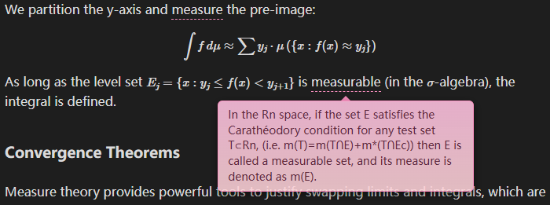

# Obsidian Inline Tooltip

A little Obsidian plugin that adds simple, elegant inline tooltips (infotips, hints, descriptions) to your notes using a customizable syntax.

It works seamlessly in both **Live Preview** and **Reading View**.

README LANGUAGE / README 语言：[English](https://github.com/yunagi7/obsidian-inline-tooltip/blob/main/README.md) [简体中文](https://github.com/yunagi7/obsidian-inline-tooltip/blob/main/README_zh.md)

*GIF here soon*

## Features

- **Simple Syntax**: Just wrap your text like this: `{Term}{Description}`.
- **Live Preview Support**:
    - When your cursor is **away**, it renders as a clean, underlined term. Hovering shows the tooltip.
    - When your cursor is **on** the term, it expands to show the source code `{Term}{Description}` for easy editing.
- **Reading View Support**: Fully rendered tooltips.
- **Customizable**: Change colors, width, font size, and toggle the arrow in settings.
- **Bilingual Support**: The plugin interface supports English and Chinese (switchable in settings).

## Usage

### Basic Syntax

Type the following in your note:

```text
{Entropy}{Entropy is a scientific concept, most commonly associated with states of disorder, randomness, or uncertainty.}
```

- **Term**: `Entropy` (This is what appears in the text).
- **Tooltip**: `Entropy is a scientific concept, most commonly associated with states of disorder, randomness, or uncertainty.` (This appears when you hover).

### Command

You can also use the command palette:

1. Select the word you want to explain.
2. Press `Ctrl/Cmd + P` and run **"Insert Inline Tooltip"**.
3. The plugin will wrap your selection and place the cursor in the explanation block.

## Settings

You can customize the look and feel in **Settings > Inline Tooltip**:

- **Language**: Switch between English and Chinese.
- **Border & Text Color**: Match your current theme.
- **Background Gradient**: Set top and bottom colors for a gradient effect.
- **Dimensions**: Adjust fixed width, max width, and font size.
- **Arrow**: Toggle the little arrow pointer below the tooltip.

Settings are stored in `.obsidian/plugins/obsidian-inline-tooltip` folder named `data.json`.

### Custom Color
*A screen shot here*

This plugin supports color formats include hexadecimal codes (e.g., `#XXXXXX`) and RGBA functional notation (e.g., `rgba(...)`).
- **Hexadecimal Format:** 
	- A hash symbol (`#`) followed by hexadecimal characters (0-9, A-F). 
	- **Example:** 
		- `#FF0000` is pure red. 
		- `#000000` is black. 
		- `#FFFFFF` is white.
- **RGBA Format:** 
	- A functional notation `rgba()` that accepts four parameters: Red, Green, Blue, and Alpha. 
	- **Example:** 
		- `rgba(255, 0, 0, 1.0)` is pure red and fully opaque. 
		- `rgba(255, 0, 0, 0.5)` is red with 50% opacity. 

#### Example: Color scheme: Sakura



If you like this color scheme, please set your colors to be:

```json
"borderColor": "rgba(255,146,196,0.95)",
"backgroundTop": "rgba(233,177,205,0.98)",
"backgroundBottom": "rgba(252,209,215,0.88)",
"textColor": "rgba(86,33,53,0.95)",
```

You can also download `sakura.json` from the [Releases](https://github.com/yunagi7/obsidian-inline-tooltip/releases) page and move it to `.obsidian/plugins/obsidian-inline-tooltip` and rename it to `data.json`.

## Installation
I am still updating this plugin. If everything goes well, this plugin will soon be available to be installed directly from within the app. 
The plugin will soon be found in the Community Plugins directory which can be accessed from the Settings pane under Third Party Plugins.

### Manual Installation

1. Download `main.js` and `manifest.json` from the [Releases](https://github.com/yunagi7/obsidian-inline-tooltip/releases) page.
2. Create a folder named `obsidian-inline-tooltip` inside your vault's `.obsidian/plugins/` folder. Note: The `.obsidian` folder may be hidden. On MacOS you should be able to press `Cmd+Shift+Dot` to show the folder in Finder.
3. Move the downloaded files into that folder.
4. Reload Obsidian and enable the plugin in settings (safe mode has to be disabled).

## Motivation

This project was born out of a desire for a cleaner writing experience. I initially implemented this functionality using a CSS snippet and manually typing `<span class="p-tooltip" data-tip="Description">Term</span>` tags. 
While effective, writing raw HTML inside Markdown quickly became tedious and cluttered the notes.

I built this plugin to solve that friction. It abstracts the complex HTML structure behind a simple `{Term}{Description}` syntax, allowing you to keep your Markdown clean while retaining the rich tooltip functionality.

## Development

Contributions and modifications are welcome!
Add more color schemes is also welcome, Simply rename your `data.json` file containing your current color configuration to `*your scheme name*.json` and upload it to the `schemes` folder.