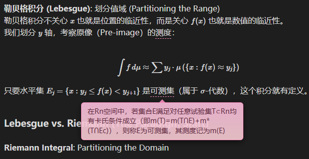

# Obsidian Inline Tooltip (行内提示框)

这就一款为 Obsidian 设计的插件，可以让你在笔记中轻松添加优雅的行内“提示框 / 词语浮动注释”（Tooltip）功能。

完美支持 **实时预览 (Live Preview)** 和 **阅读视图 (Reading View)**。

README LANGUAGE / README 语言：[English](https://github.com/yunagi7/obsidian-inline-tooltip/blob/main/README.md) [简体中文](https://github.com/yunagi7/obsidian-inline-tooltip/blob/main/README_zh.md)

*GIF here soon*

## 功能特点

- **语法简单**：只需这样写：`{词语}{浮动提示框内容}`。
- **支持实时预览**：
    - 当光标 **离开** 时，渲染为带虚线下划线的名词，鼠标悬停显示解释气泡。
    - 当光标 **移入** 时，自动展开为源码 `{词语}{浮动提示框内容}`，方便编辑修改。
- **支持阅读视图**：在阅读模式下完美渲染。
- **可定制**：在设置中自定义颜色、宽度、字体大小以及是否显示箭头。
- **双语支持**：插件界面支持中文和英文切换。

## 使用方法

### 基础语法

在笔记中输入以下格式：

```text
{熵（Entropy）}{一种测量在动力学方面不能做功的能量总数，也就是当总体的熵增加，其做功能力也下降，熵的量度正是能量退化的指标。}
```

- **第一部分**：`熵（Entropy）`（这是显示在正文中的词）。
- **第二部分**：`一种测量在动力学方面不能做功的能量总数，也就是当总体的熵增加，其做功能力也下降，熵的量度正是能量退化的指标。`（这是鼠标悬停时显示的提示框内容）。

### 快捷命令

你也可以使用命令面板：

1. 选中你想要解释的词。
2. 按下 `Ctrl/Cmd + P` 打开命令面板，搜索 **"插入提示框 (Tooltip)"**。
3. 插件会自动包裹你选中的词，并将光标定位在“提示框内容”的位置，方便你直接输入。

## 设置选项

你可以在 **设置 > Inline Tooltip** 中调整外观：

- **语言**：切换插件界面语言（中文/English）。
- **边框与文字颜色**：设置颜色以匹配你的主题。
- **背景渐变**：设置气泡背景的顶部和底部颜色。
- **尺寸调整**：调整气泡的固定宽度、最大宽度百分比和字体大小。
- **箭头**：开启或关闭气泡下方的小箭头。

插件的所有设置，包括自定义的颜色方案，都存储在您的 Obsidian 仓库目录下的 `.obsidian/plugins/obsidian-inline-tooltip` 文件夹中，文件名为 `data.json`。

### 颜色格式

本插件支持两种颜色格式，包括十六进制代码（例如：`#XXXXXX`）和 RGBA 函数表示法（例如：`rgba(...)`）。

  - **十六进制格式 (Hexadecimal)**：
      * 使用井号（`#`）开头，后跟十六进制字符（0-9，A-F）。
      * **示例**：
          * `#FF0000`：纯红色。
          * `#000000`：黑色。
          * `#FFFFFF`：白色。
  - **RGBA 格式**：
      * 使用 `rgba()` 函数表示，接受四个参数：红（Red）、绿（Green）、蓝（Blue）和 Alpha（透明度）。
      * **示例**：
          * `rgba(255, 0, 0, 1.0)`：纯红色，完全不透明。
          * `rgba(255, 0, 0, 0.5)`：红色，50% 透明度。

#### 示例：樱花主题配色 (Sakura)



如果您喜欢这套配色方案，可以在设置中手动配置：

```json
"borderColor": "rgba(255,146,196,0.95)", // 边框颜色
"backgroundTop": "rgba(233,177,205,0.98)", // 背景顶部颜色
"backgroundBottom": "rgba(252,209,215,0.88)", // 背景底部颜色
"textColor": "rgba(86,33,53,0.95)" // 文字颜色
```

您也可以从项目的 [Releases](https://github.com/yunagi7/obsidian-inline-tooltip/releases) 页面下载预设的 `sakura.json` 文件。然后将其移动到 `.obsidian/plugins/obsidian-inline-tooltip` 文件夹，并重命名为 `data.json`，即可快速应用该配色。

## 安装方法
我仍在更新此插件。如果一切顺利，不久后，您就可以直接从应用内安装此插件。
该插件很快将出现在“社区插件”目录中，您可以在“设置”面板的“第三方插件”下找到该目录。

### 手动安装

1. 从 [Releases](https://github.com/yunagi7/obsidian-inline-tooltip/releases) 页面下载 `main.js` 和 `manifest.json`。
2. 在你的仓库 `.obsidian/plugins/` 目录下创建一个文件夹，例如 `obsidian-inline-tooltip`。注意：`.obsidian` 文件夹可能处于隐藏状态。在 macOS 系统中，您应该可以按 `Cmd+Shift+Dot`在 Finder 中显示该文件夹。
3. 将下载的文件放入该文件夹。
4. 重启 Obsidian 并在第三方插件设置中启用它。

## 灵感来源

这个插件的诞生源于对效率的追求。起初，我尝试通过 CSS snippet 配合手动编写 `<span class="p-tooltip" data-tip="提示框内容">名词</span>` 到笔记中来实现悬停效果。虽然效果不错，但在 Markdown 笔记中频繁插入冗长的 HTML 代码不仅繁琐，还严重破坏了写作的流畅度。

为了解决这个问题，我开发了这个插件。它将繁杂的 HTML 标签封装在简洁的 `{名词}{提示框内容}` 语法背后，让你专注于内容创作，而无需操心底层实现，且可以自定义外观。

## 开发

欢迎贡献和修改！